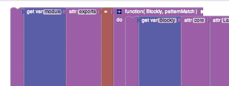
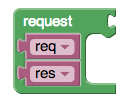

#Bloccoli Initial Thoughts & Impressions

*These initial comments are related not to Blockly proper, but to node-blockly-editor, a branch that aspires to translate not only blockly to javascript but javascript to blockly.*

The current program looks intimidating.  Part of this is because blocks never spill to the next line, creating serious horizontal leakage.  Here's one simple core improvement Blockly could use:

Much of it comes from the complexity of representing Javascript's full syntax.  It's an interesting proof of concept, but will no doubt require more massaging than I'm likely to commit to make it really smooth and fun for newcomers.

When inventing Node.js, nobody said we needed to make sure we can import Ruby before we move forward.  Instead, Node was given NPM, an easy and fun way for people to contribute and share chunks of logic.

All NPM does is define a common syntax for wrapping up code to be used by others.  By making it easy enough to share, the ecosystem exploded like magic.

While the benefits of importing javascript to blockly could be powerful, without legibility and ease of entry, I would have to seriously question who the program was built for.  Blocks by their very nature are for non-programmers, so that's who we have to keep in mind.

This leads me to consider the merits that might be explored by simply building an NPM for Blockly.

##Blockly Package Manager

1) Define a protocol to group a blockly program or other code or service into a new block/module... "Blojule", for easy code reuse.

This would allow all block-built programs to be easy to share, but as it is, the block language has only core features, and requires outside empowerment.

2) Define a protocol for defining a group of blocks.  Maybe include scaffolding for, say, node-style (common.js) javascript modules.  The key here would be not to represent every capability of the original libraries, but to expose key useful components to an intuitive block interface.

These blojules would define sets of blocks that could be displayed in a list added to the left sidebar of a blockly project, which itself could be wrapped up as a blojule and used in another project.

A new title bar (or something) would give access to adding new blojules to the current project, with a link to the full blojule package repository, with interactive browsing, maybe ratings, etc.  Make it engaging for kids.

Since these blocks would be custom-designed per module (a process that should be streamlined and at least provided cleaner tutorials), problems like having an "attr:" block can be dodged, and multiple core attributes and functions could be wrapped into a single block:

In this example, I fantasize that someone adds the ability to provide scoped variable blocks within a block, allowing asynchronous-style callback blocks.  I got this idea from [Stencyl](http://www.stencyl.com).

Of course, for simplicity, synchronous blocks could be the first round.

I'm working on simply getting Blockly up and running for right now, but I pretty much think this is the direction I'll be leaning.